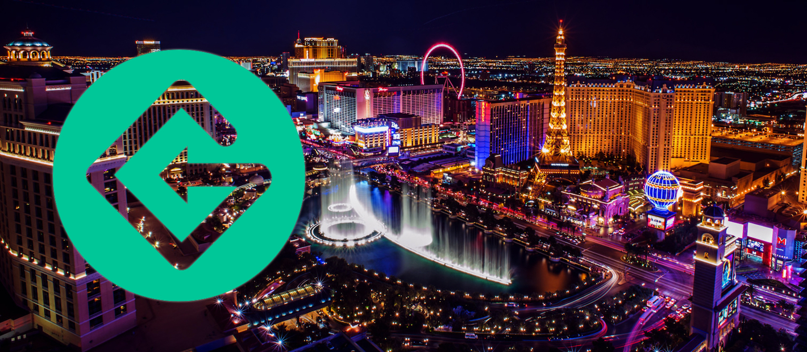

# Vegas
> In it for the holiday 🌞📈

## What is this?
Many moons ago on Telegram, Whopper and I joked about having a huge blowout in Vegas when GET hits $5. This is the realisation of that joke.

## When is this?
Thursday 15th September 2022 until Sunday 18th September 2022.

## What needs to happen?
GET needs to be trading above $5 by 1st April 2022.

If it doesn’t we’ll roll this over to the 3rd weekend of September 2023.

## Why $5?
Originally the $5 target was plucked out of the air, and over time became $10. After some discussion and back-of-a-cig-packet mathematics and a vote $5 reigned supreme.

More accurately, 1,000 GET is the amount that people are willing to allocate to make this happen and it just so happens that $5 nicely makes 1,000 GET stretch as far as it needs to.

Here are some rough costings used as a basis:
* **Flight**; $986 AMS - LAS round trip KLM. $1,972 for 2 people.
* **Airport Transfers**; $17.50pp round trip. $35 for 2 people.
* **Hotel**; ~$1,500 for 2 people, 7 nights.
	* Vdara (5*); $,1434
	* NoMad (5*); $1,588
	* ARIA (5*); $1,664
* **Buffet**; $40 pp/night. $240 for two people three times.
* **Champagne Brunch**; $25 pp/brunch. $50 for two people once.
* **Incidentals**; $50 pp/day. $700 for 7 nights.
* **Big Night**; $500.

Adding all of that up takes us to a nice neat $4,997 total for a week in Vegas for you and another in a 5-star hotel with most incidentals covered. All for the low low cost of 1,000 GET.

These are of course representative. You might wish to come alone and gamble like a mad man, or you might bring kids and stay by the pool the whole time, but it is fundamentally doable on $5,000 and that’s the point. Tweak it to your pleasing.

## Why 1000 GET?
We’ve got to set our sights somewhere and this feels like the right amount without overburdening our stacks.

At the time of writing ($0.41/GET) you can pull this together for $410.

Or alternatively if you act as a liquidity provider for the liquidity mining program contributing 1%, this will take you 3 months to collect passively without any additional investment of your own. (1% of pool with rewards of 32,000/mo = 320*3 = 960 GET, plus Uniswap fees on top.)

## A week!?
I doubt it honestly. Most of us won’t have either the stamina or the urge. The costings cover a week as I can imagine that will be the minimum anyone would be willing to travel all the way to Vegas from Amsterdam. We’ll only plan for the above 3 nights together as a group and people can dip in and out as they please.

## What will we do?
Pretty much unplanned but let’s suggest a nightly Vegas buffet and see where things go.

